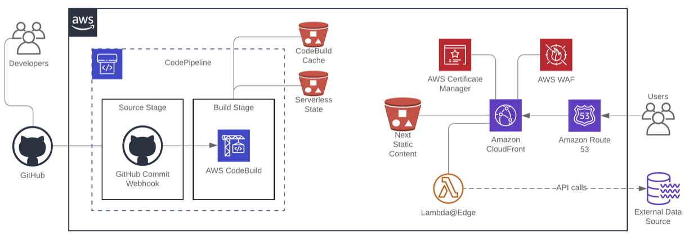

# Next.js Serverless deployment project

This project creates all the infrastructure needed to build a deployment process for the Next.js serverless app. It uses the Serverless Next.js component https://github.com/serverless-nextjs/serverless-next.js to do the app deployment.



## Deployment pipeline

The CodePipeline pipeline created in this project has two stages

- a source stage that sets up a webhook to get events from Github that trigger a pipeline execution
- a build stage that invokes the `serverless` command on the app code that build and deploys the app infra

The CodeBuild build is defined in the `buildspec.yml` file, which is stored in the Next.js app repo and looks something like this:

```
version: 0.2

env:
  secrets-manager:
    STATIC_NEXTJS_BUCKET: "DeployEnvVars:STATIC_NEXTJS_BUCKET"
    PRECREATED_CLOUDFRONT_ID: "DeployEnvVars:PRECREATED_CLOUDFRONT_ID"

    # Set in the CodePipeline build project
    # STATE_BUCKET
    #

phases:
  install:
    runtime-versions:
      nodejs: 12
    commands:
      - npm install
      - npm install serverless -g
  build:
    commands:
      - sed -e "s/\$STATIC_NEXTJS_BUCKET/$STATIC_NEXTJS_BUCKET/" serverless.yml
      - sed -e "s/\$PRECREATED_CLOUDFRONT_ID/$PRECREATED_CLOUDFRONT_ID/" serverless.yml
      #to purge the old .serverless contents and recreate them, comment out this line
      - aws s3 sync s3://$STATE_BUCKET/.serverless .serverless --delete
      - serverless
      - aws s3 sync .serverless s3://$STATE_BUCKET/.serverless --delete
      - rm .env

```

The serverless.yml file in the target app repo should look something like this:

```
awsNextApp:
  component: "@sls-next/serverless-component@1.17.0"
  inputs:
    domain: ["next", "whtsqr.com"] # [ sub-domain, domain ]
    # these values need to be imported from secrets manager as they are created in us-east-1 and
    # we can't import values from stacks across regions
    bucketName: $STATIC_NEXTJS_BUCKET
    cloudfront:
      # if you want to use an existing cloudfront distribution, provide it here
      distributionId: $PRECREATED_CLOUDFRONT_ID
      # we add some behaviours in that seem to be needed...
      public/*:
        minTTL: 10000
        maxTTL: 10000
        defaultTTL: 10000
    name:
      defaultLambda: nextjs-default-lambda
      apiLambda: nextjs-api-lambda
    build:
      env:
        NEXT_PUBLIC_WORDPRESS_URL: $NEXT_PUBLIC_WORDPRESS_URL
        NEXT_CF_ACCESS_CLIENT_ID: $NEXT_CF_ACCESS_CLIENT_ID
        NEXT_CF_ACCESS_CLIENT_SECRET: $NEXT_CF_ACCESS_CLIENT_SECRET
```

The S3 sync of the `.serverless` directory ensures that the build retains the same infrastructure between invocations.

## Before you start

You will need to create some items before you begin.

- Github Oauth token with admin:webhooks and repo access
- Hostname for CF distribution
- ACM certificate for that hostname created in the `us-east-1` region

In addition you will need to gather the outputs from the WAF/Cloudfront/S3 bucket stack, as these are created in us-east-1 and cannot be imported across regions.

These items will be used to populate values in the `secrets-stack`, described below.

## Stack creation order

You must run the stacks in this project in the right order to ensure that resources created in each are available to the next stack.

### WAF/Cloudfront/S3 bucket

Note that you will probably need to configure some hostnames and ACM certificate info in here first.

Run the stack `waf-cloudfront-stack` to deploy the static content S3 bucket, WAF and Cloudfront distribution.

```
cdk deploy waf-cloudfront-stack
```

### Secrets

This will create two secret objects:

- `DeployEnvVars` containing key/value pairs for all the environment variables that are needed in the buildspec.yml
- `Github_OAuth_Token` containing a key `value` referencing a Github OAuth token that has access to the repo and `admin:repo_hook` permissions.

Run the stack `secrets-stack` to create the needed secrets, then go into the AWS console and configure their values.

```
cdk deploy secrets-stack
```

### Pipeline and build project

Finally, run `serverless-app-pipeline-cdk` to create the pipeline and build project.

```
cdk deploy serverless-app-pipeline-cdk
```

#### What gets built by the CodeBuild project

The serverless build command `serverless` will use the serverless.yml file in the app repo to configure the build that will run in CodeBuild. As we will have pre-created the S3 bucket and the Cloudfront distribution, the `serverless` build will configure those resources and in addition will create

- two Lambda functions
- relevant profiles etc

The Lambdas are deployed as Lambda@Edge.

## Running the CDK project

The `cdk.json` file tells the CDK Toolkit how to execute your app.

This project is set up like a standard Python project. The initialization
process also creates a virtualenv within this project, stored under the .env
directory. To create the virtualenv it assumes that there is a `python3`
(or `python` for Windows) executable in your path with access to the `venv`
package. If for any reason the automatic creation of the virtualenv fails,
you can create the virtualenv manually.

To manually create a virtualenv on MacOS and Linux:

```
$ python3 -m venv .env
```

After the init process completes and the virtualenv is created, you can use the following
step to activate your virtualenv.

```
$ source .env/bin/activate
```

If you are a Windows platform, you would activate the virtualenv like this:

```
% .env\Scripts\activate.bat
```

Once the virtualenv is activated, you can install the required dependencies.

```
$ pip install -r requirements.txt
```

At this point you can now synthesize the CloudFormation template for this code.

```
$ cdk synth
```

To add additional dependencies, for example other CDK libraries, just add
them to your `setup.py` file and rerun the `pip install -r requirements.txt`
command.

## Useful commands

- `cdk ls` list all stacks in the app
- `cdk synth` emits the synthesized CloudFormation template
- `cdk deploy` deploy this stack to your default AWS account/region
- `cdk diff` compare deployed stack with current state
- `cdk docs` open CDK documentation

Enjoy!
